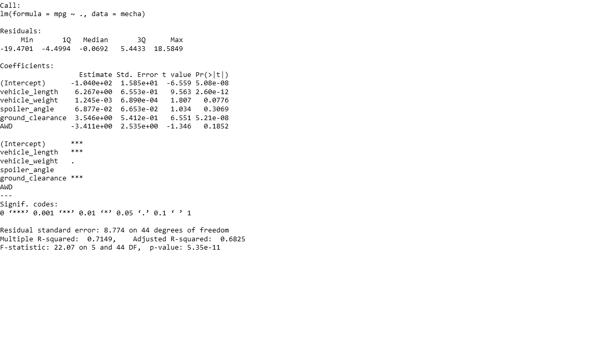
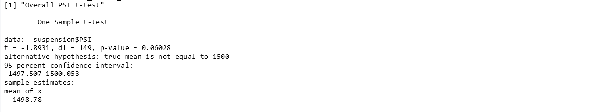
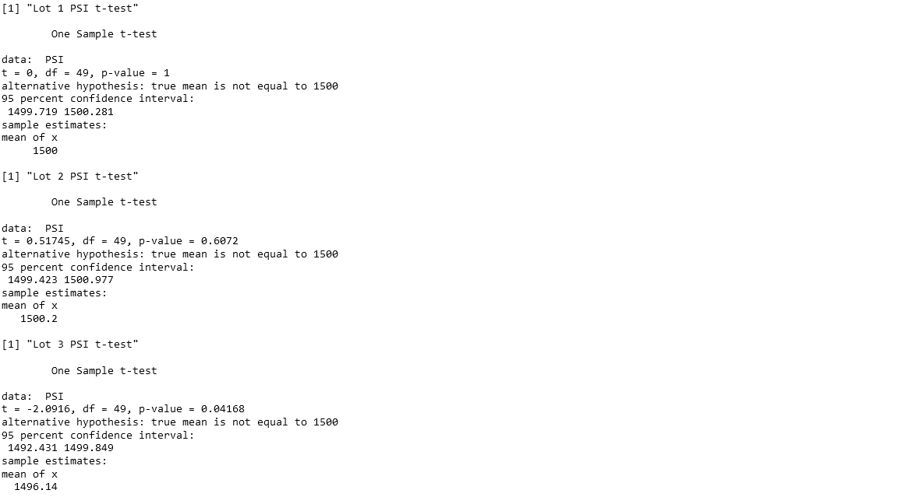

## Linear Regression to Predict MPG

##### Which variables/coefficients provided a non-random amount of variance to the mpg values in the dataset?

Based on an inspection of the p-values of each coefficient estimate, we can see that `vehicle_length` and `ground_clearance` are highly significant with p-values much much smaller than 0.001. Thus, these variables provide a non-random amount of variance to the mpg values.

##### Is the slope of the linear model considered to be zero? Why or why not?

No it's not considered to be zero. The F-statistic has a p-value of 5.35e-11 which is very tiny, in other words, highly significant. Thus we reject the null hypthosis of the F-test, that the model coefficients are all zero.

##### Does this linear model predict mpg of MechaCar prototypes effectively? Why or why not?

Yes this model predicts `mpg` effectively. The R-squared value of 0.7149 is relatively high, indicating that a high degree of variance of `mpg` is explained by the model. The adjusted R-squared, which is a more conservative estimate of goodness-of-fit is still relatively high at 0.6825.
In your README, create a subheading ## Summary Statistics on Suspension Coils, and write a short summary using screenshots from your total_summary and lot_summary dataframes, and address the following question:

    The design specifications for the MechaCar suspension coils dictate that the variance of the suspension coils must not exceed 100 pounds per square inch. Does the current manufacturing data meet this design specification for all manufacturing lots in total and each lot individually? Why or why not?

## Summary Statistics on Suspension Coils

No. The manufacturing data indicates that not all lots meet the design specification. Lot1 and Lot2 have low variances (0.98 and 7.47 respectively) so they do meet the specification. But Lot3 has a variance of 170, so it does not.

## T-Tests on Suspension Coils

For the overall t-test for mean PSI for all vehicles, the p-value is 0.06028, which is greater than the standard 0.05 significance level. In this case, we fail to reject the null hypothesis, thus concluding that there is no evidence the overall sample mean PSI values differ from the population mean value of 1500.

For individual lot t-tests for mean PSI the situation is different. The p-value for lot 1 is 1, 
for lot 2 is 0.6072, and for lot 3 is 0.04168. Thus, only lot 3 shows evidence at the 0.05 significance level to reject the null hypothesis and conclude that the sample mean PSI value differs from the population mean of 1500 PSI. The other two lots have extremely high p-values, providing no evidence of a difference from 1500 PSI

## Study Design: MechaCar vs Competition

##### What metric or metrics are you going to test?

I will test fuel economy (mpg), horsepower, top speed, 0-60mph time, price. 

###### What is the null hypothesis or alternative hypothesis?

For each of the metrics, the null hypothesis will be that the mean value of the metric for MechaCar is equal to mean value of the competition. 

The alternative hypothesis will be that the mean value of the metric for MechaCar is not equal to the mean value of the competition.

##### What statistical test would you use to test the hypothesis? And why?

We would use a t-test for the difference of means, that is, a two-sample t-test. We choose this test because, for the mean, the sample mean test statistic has a t-distribution when the sample size is small or the population standard deviation is unknown, both conditions which typically hold in practice. Since we are comparing the mean for two groups (rather than the mean of one group against the population) we use the two-sample version.

##### What data is needed to run the statistical test?

It would make sense to collect numerical data for each of the metric values. Since all metrics are naturally measured by real number, they are continuous variables, and thus suitable for t-tests. So data could be in the form of measurements (expensive but reliable) or published manufacturer data.
## Linear Regression to Predict MPG

##### Which variables/coefficients provided a non-random amount of variance to the mpg values in the dataset?

Based on an inspection of the p-values of each coefficient estimate, we can see that `vehicle_length` and `ground_clearance` are highly significant with p-values much much smaller than 0.001. Thus, these variables provide a non-random amount of variance to the mpg values.

##### Is the slope of the linear model considered to be zero? Why or why not?

No it's not considered to be zero. The F-statistic has a p-value of 5.35e-11 which is very tiny, in other words, highly significant. Thus we reject the null hypthosis of the F-test, that the model coefficients are all zero.

##### Does this linear model predict mpg of MechaCar prototypes effectively? Why or why not?

Yes this model predicts `mpg` effectively. The R-squared value of 0.7149 is relatively high, indicating that a high degree of variance of `mpg` is explained by the model. The adjusted R-squared, which is a more conservative estimate of goodness-of-fit is still relatively high at 0.6825.
In your README, create a subheading ## Summary Statistics on Suspension Coils, and write a short summary using screenshots from your total_summary and lot_summary dataframes, and address the following question:

    The design specifications for the MechaCar suspension coils dictate that the variance of the suspension coils must not exceed 100 pounds per square inch. Does the current manufacturing data meet this design specification for all manufacturing lots in total and each lot individually? Why or why not?

## Summary Statistics on Suspension Coils

No. The manufacturing data indicates that not all lots meet the design specification. Lot1 and Lot2 have low variances (0.98 and 7.47 respectively) so they do meet the specification. But Lot3 has a variance of 170, so it does not.

## T-Tests on Suspension Coils

For the overall t-test for mean PSI for all vehicles, the p-value is 0.06028, which is greater than the standard 0.05 significance level. In this case, we fail to reject the null hypothesis, thus concluding that there is no evidence the overall sample mean PSI values differ from the population mean value of 1500.

For individual lot t-tests for mean PSI the situation is different. The p-value for lot 1 is 1, 
for lot 2 is 0.6072, and for lot 3 is 0.04168. Thus, only lot 3 shows evidence at the 0.05 significance level to reject the null hypothesis and conclude that the sample mean PSI value differs from the population mean of 1500 PSI. The other two lots have extremely high p-values, providing no evidence of a difference from 1500 PSI

## Study Design: MechaCar vs Competition

##### What metric or metrics are you going to test?

I will test fuel economy (mpg), horsepower, top speed, 0-60mph time, price. 

###### What is the null hypothesis or alternative hypothesis?

For each of the metrics, the null hypothesis will be that the mean value of the metric for MechaCar is equal to mean value of the competition. 

The alternative hypothesis will be that the mean value of the metric for MechaCar is not equal to the mean value of the competition.

##### What statistical test would you use to test the hypothesis? And why?

We would use a t-test for the difference of means, that is, a two-sample t-test. We choose this test because, for the mean, the sample mean test statistic has a t-distribution when the sample size is small or the population standard deviation is unknown, both conditions which typically hold in practice. Since we are comparing the mean for two groups (rather than the mean of one group against the population) we use the two-sample version.

##### What data is needed to run the statistical test?

It would make sense to collect numerical data for each of the metric values. Since all metrics are naturally measured by real number, they are continuous variables, and thus suitable for t-tests. So data could be in the form of measurements (expensive but reliable) or published manufacturer data.

